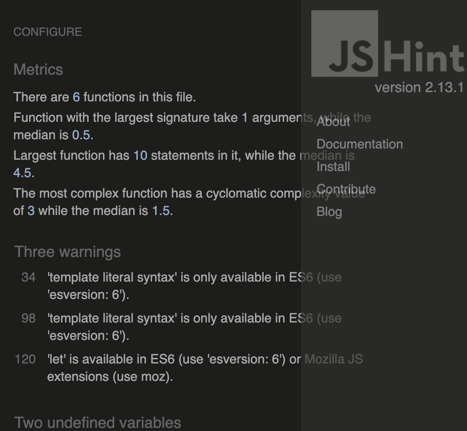

# Crypto Connect Testing

- [Validation](#validation)
  * [W3 HTML](#w3-html)
  * [W3 CSS](#w3-css)
  * [JavaScript](#javascript)
  * [Python](#python)
  * [Google Lighthouse Audit](#google-lighthouse-audit)
- [Responsive Device & Browser Testing](#responsive-device--browser-testing)
  * [Responsiveness](#responsiveness)
  * [Browser Compatibility](#browser-compatibility)
- [Testing User Stories](#testing-user-stories)
- [Issues I had to overcome](#issues-i-had-to-overcome)
- [Issues still to overcome](#issues-still-to-overcome)

## Validation

### W3 HTML

I validated the HTML with [W3C Validation Service](https://validator.w3.org/). All the errors shown were related to jinja templating as the W3C Validator for HTML does not understand the Jinja templating syntax. Apart from that, all of the codes were validating fine with no other issues raised.

### W3 CSS

I validated the CSS with the [W3 Validation Service](https://jigsaw.w3.org/css-validator/) and it found no errors.

### JavaScript

I validated the JavaScript with [JSHint](https://jshint.com/).

 

### Python

I validated the Python code was PEP 8 compliaint via the [PEP8 Online](http://pep8online.com/) and [SNYK](https://snyk.io/product/open-source-security-management/) and found no errors.

### Google Lighthouse Audit

I used Google's lighthouse audit in the Chrome DevTools to test the website conforms positively with Google's performance metrics.

After running the audit, the site received the below scores;

This shows 90%+ scores for all areas, apart from Best Practices.
Upon checking the reasoning for the low Best Practices score, I decided to not take further action to improve the score as this was due to the logo with a low resolution. The animated logo is clearly visable across all devices and resolutions, therefore no further step is taken to improve its resolution.

## Responsive Device & Browser Testing

This website was developed using the Mobile First philosophy.
To test the responsiveness of the site I used [Chrome DevTools](https://developers.google.com/web/tools/chrome-devtools) and [Responsive Design Checker](https://www.responsivedesignchecker.com/).

### Responsiveness

To ensure responsive design, I used bootstrap, CSS and media queries to ensure all site pages resized responsively for all mainstream device viewports.

### Browser Compatibility
The website has been manually tested using the following browers.
- Chrome 
- Edge
- Firefox
- Safari

## Testing User Stories

## Issues I had to overcome

## Issues still to overcome
